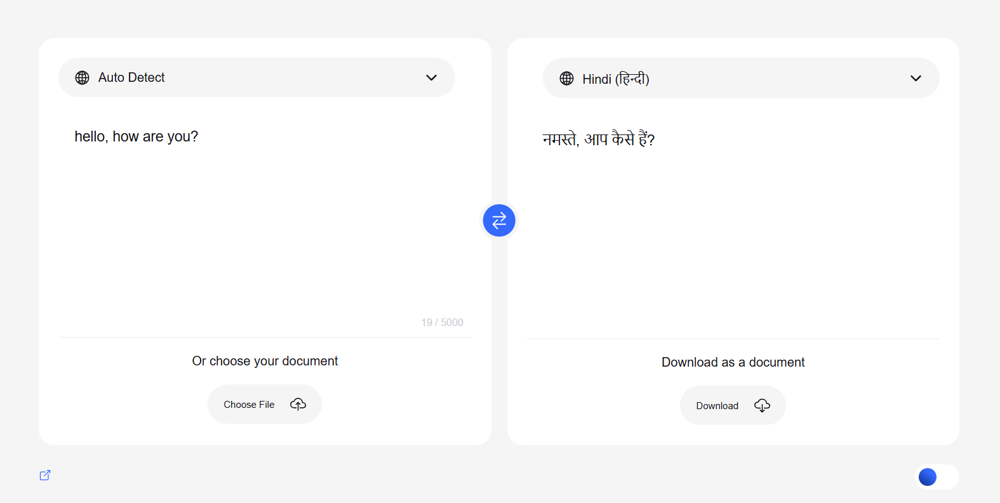

# Language Translator

A modern web-based language translation tool built with HTML, CSS, and JavaScript, powered by the Google Translate API.

<p align="center">
  
</p>


## Overview
This project provides a user-friendly interface for translating text between multiple languages. It leverages the Google Translate API to deliver accurate translations while maintaining a clean, intuitive user experience.

## Features
* Support for multiple languages
* Real-time translation
* Clean and responsive user interface
* Auto-language detection
* Character count display
* Mobile-friendly design

## Technologies Used
* HTML5
* CSS3
* JavaScript (ES6+)
* Google Translate API

## Installation

1. Clone the repository:
```bash
git clone https://github.com/subashbaniyaa/language-translator.git
cd language-translator
```

2. Set up Google Translate API:
   * Visit the Google Cloud Console
   * Create a new project or select an existing one
   * Enable the Cloud Translation API
   * Create credentials (API key)
   * Replace the API key in `script.js`

## Usage

1. Open `index.html` in your web browser
2. Select the source language from the dropdown menu
3. Enter the text you want to translate
4. Select the target language
5. The translation will appear automatically

## Contributing
Contributions are welcome! Please feel free to submit a Pull Request. For major changes, please open an issue first to discuss what you would like to change.

1. Fork the project
2. Create your feature branch (`git checkout -b feature/AmazingFeature`)
3. Commit your changes (`git commit -m 'Add some AmazingFeature'`)
4. Push to the branch (`git push origin feature/AmazingFeature`)
5. Open a Pull Request

## License
This project is licensed under the MIT License - see the [LICENSE](LICENSE) file for details.

⭐ Star this repository if you find it cool!